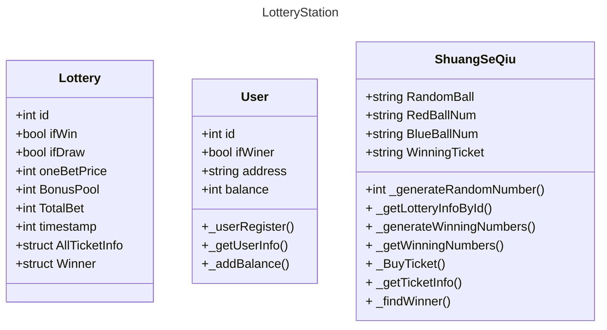

# FairLottery 智能合约

***from：BJTU Yujia***

***Warning：Not final version, still updating...***

### 一、“类”设计

- `Lottery:` 彩票玩法的基类
- `User:` 用户类
- `ShuangSeQiu:` 继承自`Lottery`，双色球玩法



### 二、如何运行本合约

#### （一）简单方法运行——使用Remix在线IDE

访问https://remix.ethereum.org/，Remix IDE官方网站，新建一个智能合约项目，在编译器选项中选择`0.5.2`版本，编译`Main.sol`文件，选择测试区块链部署后即可使用

#### （二）使用Truffle 框架在本地编译运行

1、安装Truffle

```shell
npm install -g truffle
```

输入 

```
truffle -v
```

现实版本号则为成功

2、启动Truffle

进入项目文件夹（初始空文件夹），输入

```
truffle init
```

进行初始化，观察文件目录：

- `contracts/`: Directory for [Solidity contracts](https://trufflesuite.com/docs/truffle/getting-started/interacting-with-your-contracts)
- `migrations/`: Directory for [scriptable deployment files](https://trufflesuite.com/docs/truffle/getting-started/running-migrations#migration-files)
- `test/`: Directory for test files for [testing your application and contracts](https://trufflesuite.com/docs/truffle/testing/testing-your-contracts)
- `truffle-config.js`: Truffle [configuration file](https://trufflesuite.com/docs/truffle/reference/configuration)

3、启动本智能合约

首先将本项目`clone`到本地并进入项目文件夹，确保本文件夹已经初始化了truffle 环境

编译：

```
truffle compile
```

启动测试链：
```
truffle develop
```

将本合约部署在测试链：
```
migrate
```

示例化合约（这个说法不准确，是我自己创造的）：

```
let main = await Main.deployed();
```

应该返回undefined

然后你就可以愉快的运行函数了：

例如：

```
main._userRegister("Alice", from{accounts[0]});
```

### 三、DApp开发资料

详细见仓库：https://github.com/Blockchain-zju/blockchainer-roadmap
